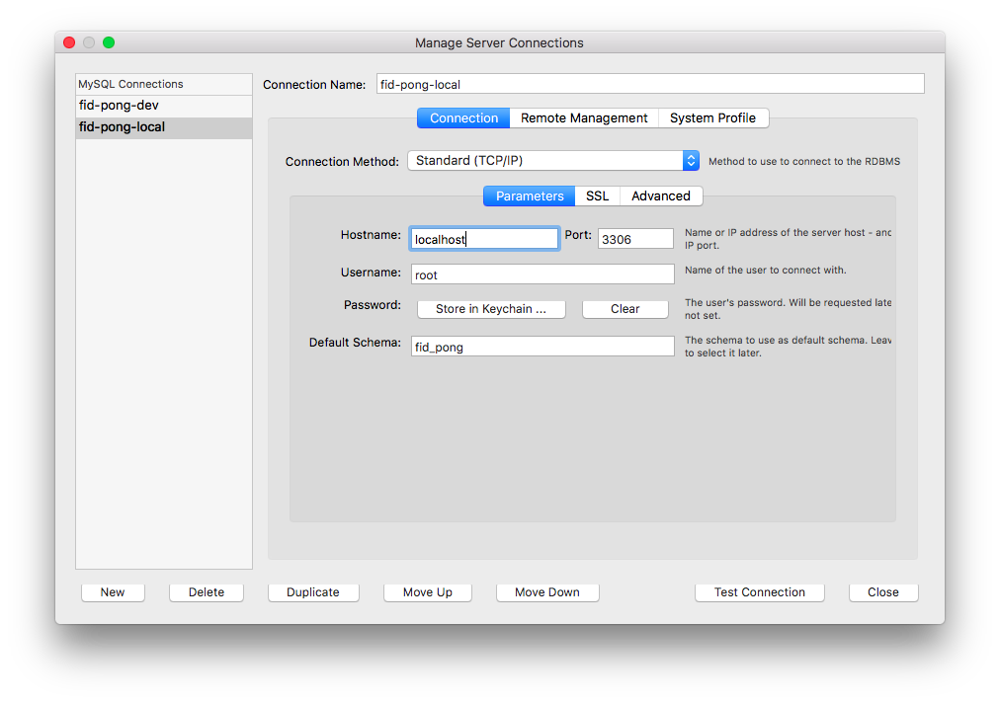
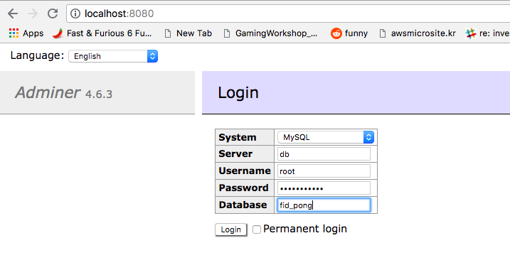

# fid-pong-db
Home for the Fid Pong Database DDL's and deployment scripts.

# To Run Locally

## Requirements

* Java 8
* Maven 3.3.1+
* Bash
* Docker 1.17+

## Steps

### Start MySQL and Deploy Schema

This project relies on being able to run MySQL in a docker container locally for testing.
Please consult [The MySQL DockerHub Repo](https://hub.docker.com/_/mysql/) for support.

1. Setup scripts have been provided in the `./bin` folder
2. to start MySQL locally run `./bin/start_mysql.sh`
    * This will run a MySQL container, and an adminer container
    * NOTE: It will take a few seconds to the database to correctly initalize
3. To use Liquibase to deploy the SQL DDLs rn `./bin/run_changelog.sh`
    * This uses the Maven Liquibase plugin to update the tables in the DB

### Develop Using UI

If you want to use a MySQL GUI to aid in development, here are a few ways to do so

#### Using MySQL Workbench

1. Inside MySQL Workbench, setup a new connection
2. Use the following config to connect
    * Hostname: localhost
    * Port: 3306
    * Username: root
    * Password: password123
    * Default Schema: fid_pong

Here's an example image

#### Using Adminer

Adminer is a light weight database management application that can be accessed
via a brower

1. Open a Web Browser
2. go to <http://locahost:8080>
3. Use the following config to connect
    * System: MySQL
    * Sever: db
    * Username: root
    * Password: password123
    * Database: fid_pong

Here's an example image

### Shutdown MySQL
1. To shutdown the local env simply run `./bin/stop_mysql.sh`
    * This will stop the running docker containers
    * All changes made to the DB are saved in `./bin/datadir/`, this way when you restart mysql, 
      all of the previous tables and records will be present
2.  To remove all data and start fresh, run `./bin/reset_datadir.sh`
